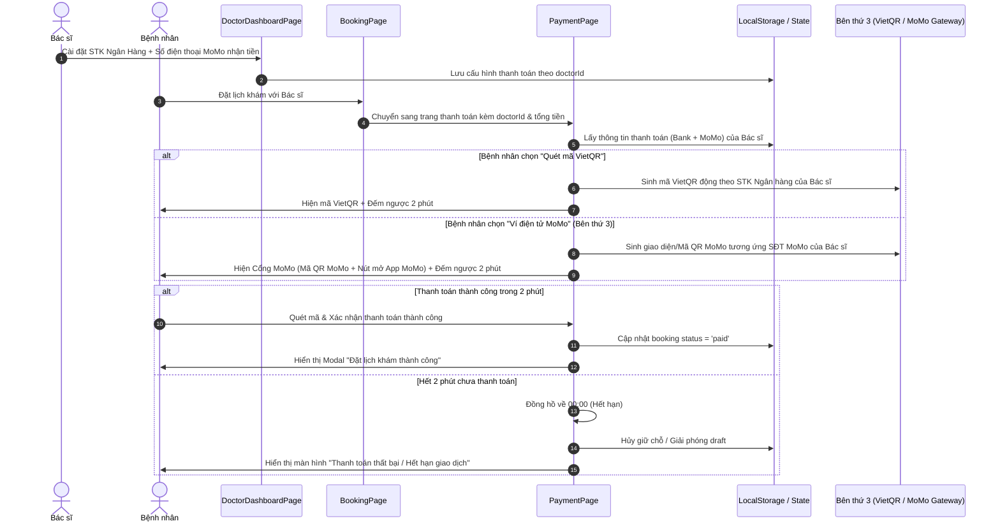

# TÀI LIỆU ĐẶC TẢ KỸ THUẬT & HƯỚNG DẪN AI TRIỂN KHAI: HỆ THỐNG THANH TOÁN VIETQR & VÍ ĐIỆN TỬ MOMO BÊN THỨ 3 THEO TÀI KHOẢN BÁC SĨ (KÈM ĐẾM NGƯỢC 2 PHÚT)

> **Dành cho:** AI Assistant / Lập trình viên tiếp nhận dự án `MiniProject_IS207_AI`  
> **Ngôn ngữ & Công nghệ:** React (Vite), Tailwind CSS, Lucide React, LocalStorage, VietQR Open API, MoMo P2P & Gateway Interface.  
> **Mục tiêu:** 
> 1. Cho phép **Bác sĩ** cấu hình thông tin nhận tiền gồm: **Tài khoản Ngân hàng (VietQR)** và **Tài khoản Ví MoMo (Số điện thoại & Tên chủ ví)** trên trang Quản lý Bác sĩ.
> 2. Phía **Bệnh nhân**, khi đặt lịch với Bác sĩ đó:
>    - Nếu chọn **"Quét mã VietQR / MoMo"**: Sinh ra mã VietQR thật chuyển thẳng vào STK Ngân hàng của Bác sĩ.
>    - Nếu chọn **"Ví điện tử (MoMo / ZaloPay / VNPay)"**: Kích hoạt cổng thanh toán Ví MoMo bên thứ 3 tương ứng với tài khoản MoMo của Bác sĩ (hỗ trợ quét App MoMo thật hoặc mở cổng MoMo).
> 3. Cả 2 phương thức đều tích hợp **đồng hồ đếm ngược 2 phút (120s)**.
> 4. Khi thanh toán thành công trong 2 phút: Hiển thị màn hình **Đặt lịch & Thanh toán Thành công**.
> 5. Khi hết thời gian 2 phút mà chưa thanh toán: Hiển thị thông báo **Thanh toán Thất bại / Hết hạn giao dịch**, hủy/giải phóng đơn khám.

---

## 1. TỔNG QUAN LUỒNG NGHIỆP VỤ (WORKFLOW)



---

## 2. CÁC TẬP TIN CẦN CAN THIỆP & TẠO MỚI

| STT | Đường dẫn file | Nhiệm vụ |
| :--- | :--- | :--- |
| 1 | `src/data/banks.js` *(Tạo mới)* | Danh sách các ngân hàng Việt Nam hỗ trợ chuẩn VietQR (Mã, Tên, Logo). |
| 2 | `src/utils/storage.js` *(Cập nhật)* | Thêm `STORAGE_KEYS.DOCTOR_PAYMENT_ACCOUNTS`, các hàm lấy/lưu tài khoản Ngân hàng và MoMo của bác sĩ. |
| 3 | `src/data/doctors.js` *(Cập nhật)* | Bổ sung trường tài khoản mặc định `paymentAccount` (Bank & MoMo) cho mỗi bác sĩ. |
| 4 | `src/pages/DoctorDashboardPage.jsx` *(Cập nhật)* | Thêm Tab **"Tài khoản thanh toán"** để Bác sĩ xem và cập nhật cả STK Ngân Hàng lẫn Ví MoMo. |
| 5 | `src/pages/PaymentPage.jsx` *(Cập nhật)* | Tích hợp mã VietQR động + Cổng MoMo bên thứ 3 theo tài khoản bác sĩ, đồng hồ đếm ngược 2 phút, xử lý Thành công / Thất bại. |

---

## 3. CẤU TRÚC DỮ LIỆU TÀI KHOẢN THANH TOÁN BÁC SĨ

Thông tin tài khoản thanh toán của Bác sĩ được lưu trữ dạng Object với 2 phần riêng biệt:

```javascript
{
  doctorId: "doc_2",
  // 1. Tài khoản ngân hàng (VietQR)
  bankAccount: {
    bankId: "MB",
    bankName: "Ngân hàng Quân Đội (MBBank)",
    accountNumber: "0345678999",
    accountName: "NGUYEN THI BAY"
  },
  // 2. Tài khoản Ví MoMo nhận tiền
  momoAccount: {
    phoneNumber: "0987654321",
    accountName: "TS. BS NGUYỄN THỊ BẢY",
    personalQrUrl: "" // (Tùy chọn) Link ảnh QR cá nhân của Bác sĩ
  },
  updatedAt: "2026-09-28T21:00:00.000Z"
}
```

---

## 4. CHI TIẾT TRIỂN KHAI TỪNG BƯỚC (STEP-BY-STEP)

### BƯỚC 1: Tạo danh sách ngân hàng `src/data/banks.js`
Tạo file mới `src/data/banks.js` cung cấp danh sách mã ngân hàng chuẩn VietQR:

```javascript
// src/data/banks.js
export const VIETQR_BANKS = [
  { id: 'MB', name: 'Ngân hàng Quân Đội (MBBank)', code: 'MBBank' },
  { id: 'VCB', name: 'Ngân hàng Ngoại Thương (Vietcombank)', code: 'Vietcombank' },
  { id: 'TCB', name: 'Ngân hàng Kỹ Thương (Techcombank)', code: 'Techcombank' },
  { id: 'BIDV', name: 'Ngân hàng Đầu tư & Phát triển (BIDV)', code: 'BIDV' },
  { id: 'CTG', name: 'Ngân hàng Công Thương (VietinBank)', code: 'VietinBank' },
  { id: 'ACB', name: 'Ngân hàng Á Châu (ACB)', code: 'ACB' },
  { id: 'TPB', name: 'Ngân hàng Tiên Phong (TPBank)', code: 'TPBank' },
  { id: 'VPB', name: 'Ngân hàng Việt Nam Thịnh Vượng (VPBank)', code: 'VPBank' },
  { id: 'STB', name: 'Ngân hàng Sài Gòn Thương Tín (Sacombank)', code: 'Sacombank' },
  { id: 'VIB', name: 'Ngân hàng Quốc Tế (VIB)', code: 'VIB' },
  { id: 'HDB', name: 'Ngân hàng Phát triển TP.HCM (HDBank)', code: 'HDBank' },
  { id: 'SHB', name: 'Ngân hàng Sài Gòn - Hà Nội (SHB)', code: 'SHB' },
  { id: 'OCB', name: 'Ngân hàng Phương Đông (OCB)', code: 'OCB' },
  { id: 'MSB', name: 'Ngân hàng Hàng Hải (MSB)', code: 'MSB' },
];
```

---

### BƯỚC 2: Cập nhật Storage Helper trong `src/utils/storage.js`
Bổ sung key và hàm quản lý thông tin tài khoản bác sĩ:

```javascript
// Thêm vào STORAGE_KEYS trong src/utils/storage.js:
DOCTOR_PAYMENT_ACCOUNTS: 'medsi_doctorPaymentAccounts',

// Thêm các hàm helper lấy/lưu:
export function getDoctorPaymentAccount(doctorId) {
  const accounts = getStorage(STORAGE_KEYS.DOCTOR_PAYMENT_ACCOUNTS, {});
  return accounts[doctorId] || null;
}

export function saveDoctorPaymentAccount(doctorId, accountData) {
  const accounts = getStorage(STORAGE_KEYS.DOCTOR_PAYMENT_ACCOUNTS, {});
  accounts[doctorId] = {
    ...accountData,
    updatedAt: new Date().toISOString(),
  };
  setStorage(STORAGE_KEYS.DOCTOR_PAYMENT_ACCOUNTS, accounts);
  return accounts[doctorId];
}
```

---

### BƯỚC 3: Cập nhật dữ liệu mặc định trong `src/data/doctors.js`
Thêm cấu hình thanh toán mặc định (cả Ngân hàng lẫn MoMo) cho mỗi Bác sĩ để khi người dùng chưa cấu hình thì vẫn có dữ liệu mẫu:

```javascript
// Thêm trường paymentAccount vào mỗi bác sĩ trong src/data/doctors.js
{
  id: 'doc_2',
  name: 'TS. BS Nguyễn Thị Bảy',
  // ... các trường thông tin bác sĩ cũ
  paymentAccount: {
    bankAccount: {
      bankId: 'MB',
      bankName: 'Ngân hàng Quân Đội (MBBank)',
      accountNumber: '0345678999',
      accountName: 'NGUYEN THI BAY',
    },
    momoAccount: {
      phoneNumber: '0987654321',
      accountName: 'NGUYEN THI BAY',
    }
  }
}
```

---

### BƯỚC 4: Thêm giao diện cấu hình tài khoản trong `src/pages/DoctorDashboardPage.jsx`

Trong `DoctorDashboardPage.jsx`, bổ sung tab mới: `activeTab === 'payment'` (Tài khoản thanh toán):

1. **Phần 1: Cấu hình Tài khoản Ngân Hàng (VietQR)**:
   - Dropdown chọn Ngân hàng từ `VIETQR_BANKS`.
   - Ô nhập Số tài khoản.
   - Ô nhập Tên chủ tài khoản (in hoa không dấu).
   - Live Preview: Hiển thị ngay ảnh mã VietQR thật tạo từ `https://img.vietqr.io/image/{bankId}-{accountNumber}-compact2.png`.

2. **Phần 2: Cấu hình Ví Điện Tử MoMo Nhận Tiền**:
   - Ô nhập **Số điện thoại Ví MoMo** của bác sĩ (ví dụ: `0987654321`).
   - Ô nhập **Tên hiển thị Ví MoMo** (ví dụ: `NGUYEN THI BAY`).
   - Live Preview MoMo: Hiển thị mã QR MoMo thanh toán tương ứng và hướng dẫn bác sĩ dùng app MoMo quét thử.

3. Nút bấm **"Lưu cấu hình thanh toán"**:
   - Lưu vào LocalStorage qua `saveDoctorPaymentAccount(doctorId, data)`.
   - Hiển thị Toast thông báo thành công.

---

### BƯỚC 5: Nâng cấp `src/pages/PaymentPage.jsx` (Trọng tâm)

#### 5.1. Lấy thông tin tài khoản của Bác sĩ được đặt lịch
```javascript
import { getDoctorPaymentAccount } from '../utils/storage';
import { DOCTORS } from '../data/doctors';

// Trong PaymentPage:
const savedConfig = draft.doctorId ? getDoctorPaymentAccount(draft.doctorId) : null;
const defaultDoctor = draft.doctorId ? DOCTORS.find(d => d.id === draft.doctorId)?.paymentAccount : null;

const activeBank = savedConfig?.bankAccount || defaultDoctor?.bankAccount || {
  bankId: 'MB',
  bankName: 'MBBank',
  accountNumber: '0388888888',
  accountName: draft.providerName || 'PHONG KHAM MEDSI',
};

const activeMomo = savedConfig?.momoAccount || defaultDoctor?.momoAccount || {
  phoneNumber: '0988888888',
  accountName: draft.providerName || 'PHONG KHAM MEDSI',
};
```

#### 5.2. Xây dựng bộ đếm ngược 2 phút (Countdown Timer) dùng chung cho cả VietQR và MoMo
```javascript
const [timeLeft, setTimeLeft] = useState(120); // 120s = 2 phút
const [isExpired, setIsExpired] = useState(false);

useEffect(() => {
  // Bật đếm ngược cho cả phương thức 'qr' và 'ewallet'
  if ((selectedMethod !== 'qr' && selectedMethod !== 'ewallet') || isExpired || isSuccessModalOpen) {
    return;
  }

  const timer = setInterval(() => {
    setTimeLeft((prev) => {
      if (prev <= 1) {
        clearInterval(timer);
        setIsExpired(true);
        return 0;
      }
      return prev - 1;
    });
  }, 1000);

  return () => clearInterval(timer);
}, [selectedMethod, isExpired, isSuccessModalOpen]);

const formatTime = (seconds) => {
  const m = Math.floor(seconds / 60).toString().padStart(2, '0');
  const s = (seconds % 60).toString().padStart(2, '0');
  return `${m}:${s}`;
};
```

#### 5.3. Xử lý khi chọn "Quét mã VietQR / MoMo" (`selectedMethod === 'qr'`)
* Sinh link VietQR thật chuẩn ngân hàng:
```javascript
const transferContent = `MEDSI ${draft.patientPhone || 'KHAM'} ${draft.date.replace(/-/g, '')}`;
const vietQrUrl = `https://img.vietqr.io/image/${activeBank.bankId}-${activeBank.accountNumber}-compact2.png?amount=${draft.totalAmount}&addInfo=${encodeURIComponent(transferContent)}&accountName=${encodeURIComponent(activeBank.accountName)}`;
```

#### 5.4. Xử lý khi chọn "Ví điện tử (ZaloPay / ShopeePay / VNPay / MoMo)" (`selectedMethod === 'ewallet'`)
* Khi bệnh nhân chọn Ví điện tử, ưu tiên hiển thị Cổng thanh toán **Ví MoMo Bên Thứ 3**:
* **Cơ chế tạo mã QR MoMo chuẩn quét App thật (MoMo P2P Standard)**:
  Ứng dụng MoMo hỗ trợ chuỗi QR chuyển tiền trực tiếp:
  ```text
  2|99|{SỐ_ĐIỆN_THOẠI_BÁC_SĨ}|{TÊN_BÁC_SĨ}||0|0|{SỐ_TIỀN}|{LỜI_NHẮN}
  ```
  Code tạo URL mã QR MoMo:
```javascript
const momoPayload = `2|99|${activeMomo.phoneNumber}|${activeMomo.accountName}||0|0|${draft.totalAmount}|MEDSI_${draft.date.replace(/-/g, '')}`;
const momoQrUrl = `https://api.qrserver.com/v1/create-qr-code/?size=220x220&data=${encodeURIComponent(momoPayload)}`;
```
* **Giao diện Cổng MoMo bên thứ 3**:
  * Logo MoMo đặc trưng màu hồng sang trọng (`#d82d8b`).
  * Khung quét mã QR MoMo với dòng chữ *"Mở App MoMo quét mã để thanh toán"*.
  * Nút bấm tiện ích: **"Mở ứng dụng MoMo trên điện thoại"** (Deep link: `momo://?action=pay&amount=${draft.totalAmount}&phone=${activeMomo.phoneNumber}`).
  * Thông tin tài khoản nhận tiền: **SĐT Bác sĩ**: `activeMomo.phoneNumber` - **Chủ ví**: `activeMomo.accountName`.
  * Nút giả lập chuyển hướng Cổng MoMo Sandbox (nếu muốn mở cửa sổ MoMo Checkout bên thứ 3).

#### 5.5. Trạng thái Thất bại khi Quá 2 phút (`isExpired === true`)
* Khi hết 2 phút (`timeLeft === 0`):
  1. Khóa toàn bộ nút thanh toán (`disabled`).
  2. Mờ mờ (blur) mã QR kèm icon khóa đỏ.
  3. Hiển thị thông báo hoặc Modal Thất bại:
     * **Tiêu đề:** "Giao dịch thất bại / Đã hết thời hạn thanh toán (2 phút)"
     * **Nội dung:** "Thời gian giữ chỗ và hiệu lực của mã thanh toán đã kết thúc để đảm bảo tính khả dụng cho các bệnh nhân khác. Vui lòng tạo lại mã hoặc chọn khung giờ khác."
     * **2 Nút hành động:**
       - **"Thử lại / Lấy mã mới"**: Reset `timeLeft = 120`, `isExpired = false`.
       - **"Chọn lại khung giờ khác"**: Điều hướng về trang chọn giờ khám `BookingPage`.

#### 5.6. Trạng thái Thanh toán Thành công
* Dưới khung mã QR (cả VietQR và MoMo), có nút:
  * **"Tôi đã chuyển khoản xong"** hoặc **"Kiểm tra trạng thái thanh toán"**.
* Khi người dùng click:
  1. Hiển thị animation kiểm tra trạng thái 1-1.5s (giả lập webhook/polling từ bên thứ 3).
  2. Xác nhận thành công -> Lưu booking vào Storage với trạng thái `paymentStatus: 'paid'`.
  3. Mở Modal **"Đặt lịch khám thành công"** có mã đặt lịch, chi tiết phòng khám, thời gian khám và mã hóa đơn.

---

## 5. MẪU GIAO DIỆN (UI/UX SPECIFICATION)

### Khung Cổng MoMo Bên Thứ 3 trên `PaymentPage`
```text
+-------------------------------------------------------------+
|  [Logo MoMo]  CỔNG THANH TOÁN VÍ ĐIỆN TỬ MOMO              |
|  Đồng hồ đếm ngược: ⏳ 01:54 (Hết hạn sau 2 phút)          |
+-------------------------------------------------------------+
|                                                             |
|           +---------------------------+                     |
|           |                           |                     |
|           |      [ MÃ QR MOMO ]       |                     |
|           |       (Quét thật)         |                     |
|           |                           |                     |
|           +---------------------------+                     |
|                                                             |
|  Chủ ví MoMo: TS. BS Nguyễn Thị Bảy                         |
|  Số điện thoại: 0987 *** 321                                |
|  Số tiền: 1.030.000 đ                                       |
|  Nội dung: MEDSI 0912345678                                 |
|                                                             |
|  [ Nút: Mở App MoMo thanh toán ]                           |
|  [ Nút: Tôi đã thanh toán trên MoMo ]                       |
+-------------------------------------------------------------+
```

---

## 6. KỊCH BẢN KIỂM THỬ (TEST CASES / ACCEPTANCE CRITERIA)

| Mã test | Tình huống kiểm tra | Kết quả mong đợi |
| :--- | :--- | :--- |
| **TC-01** | Bác sĩ vào `DoctorDashboardPage` -> Tab "Tài khoản thanh toán" -> Nhập SĐT MoMo và STK Ngân Hàng của mình rồi lưu lại. | Hệ thống báo lưu thành công. Ảnh xem trước mã QR VietQR và MoMo cập nhật chuẩn xác. |
| **TC-02** | Bệnh nhân đặt lịch với Bác sĩ -> Chọn "Quét mã VietQR" -> Kiểm tra mã QR. | Quét bằng App ngân hàng ra đúng STK và tên của Bác sĩ vừa cấu hình. Đồng hồ đếm ngược từ `02:00`. |
| **TC-03** | Bệnh nhân đặt lịch với Bác sĩ -> Chọn "Ví điện tử (MoMo)" -> Kiểm tra giao diện. | Xuất hiện cổng MoMo, mã QR MoMo quét app MoMo ra đúng SĐT Bác sĩ và số tiền. Đồng hồ đếm ngược từ `02:00`. |
| **TC-04** | Bệnh nhân bấm "Tôi đã thanh toán trên MoMo" trong vòng 2 phút. | Hệ thống chuyển sang modal "Đặt lịch khám thành công", trạng thái lưu là `paid`, phương thức ghi nhận `Ví điện tử MoMo`. |
| **TC-05** | Bệnh nhân để nguyên màn hình quá 2 phút không thực hiện gì. | Đồng hồ chạm `00:00`. Hệ thống khóa mã QR và hiển thị thông báo **"Giao dịch thất bại / Đã hết thời hạn 2 phút"**, cho phép tạo lại mã mới. |

---

## 7. HƯỚNG DẪN DÀNH CHO AI THỰC HIỆN CODE

Khi AI đọc file này để lập trình:
1. Đảm bảo cấu trúc dữ liệu `paymentAccount` trong `storage.js` hỗ trợ cả 2 trường `bankAccount` và `momoAccount`.
2. Giữ nguyên giao diện đẹp mắt, dùng icon `Wallet` / `QrCode` từ `lucide-react`.
3. Kiểm tra tính tương thích: Mã QR VietQR và QR MoMo đều quét được trực tiếp trên điện thoại di động thực tế.
4. Chạy `npm run dev` hoặc kiểm tra build bằng `npm run build` để đảm bảo không có lỗi cú pháp hoặc import.
